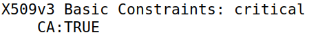
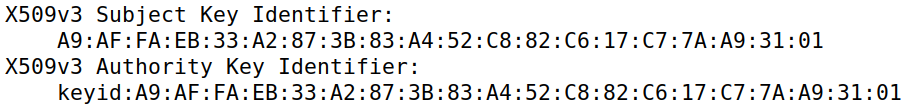
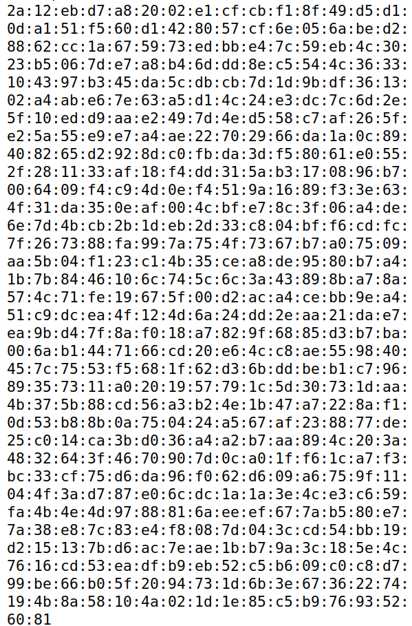
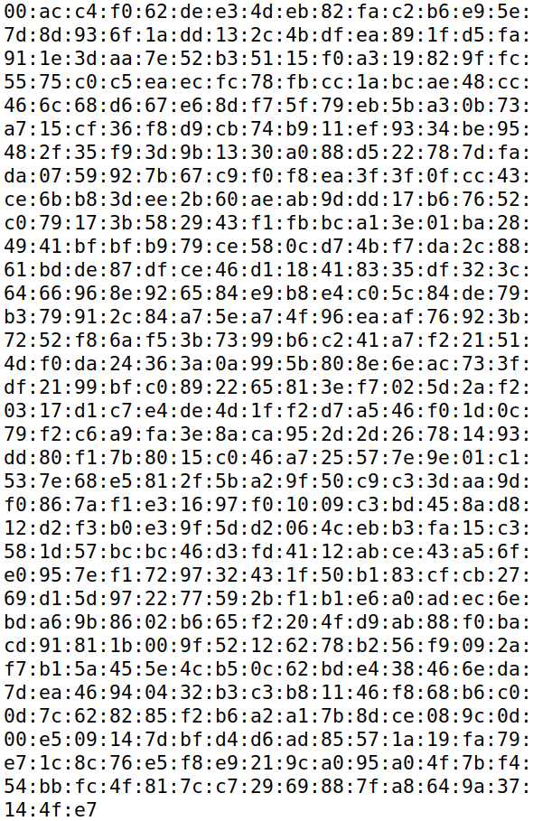
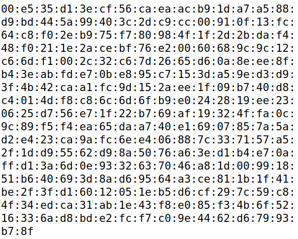
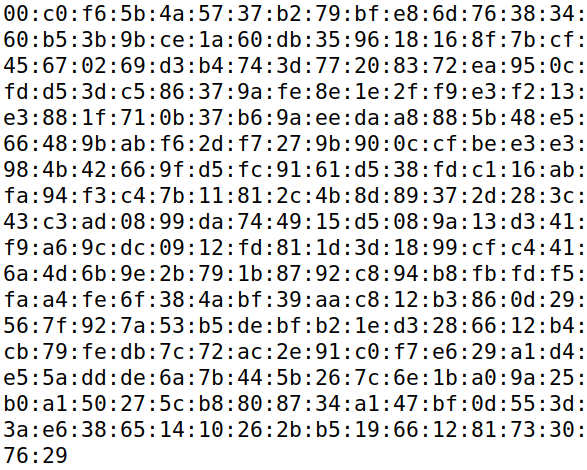

# Task 1
## What part of the certificate indicates this is a CA’s certificate?

## What part of the certificate indicates this is a self-signed certificate?

The Subject Key Identifier and the Authority Key Identifier being the same indicates this certificate is self-signed.
## In the RSA algorithm, we have a public exponent e, a private exponent d, a modulus n, and two secret numbers p and q, such that n = pq. Please identify the values for these elements in your certificate and key files.

### Public Exponent
65537

### Private Exponent

### Modulus

### Prime 1

### Prime 2

# Task 2

