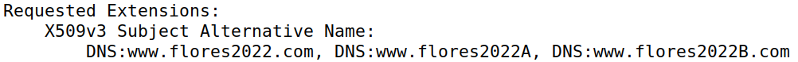
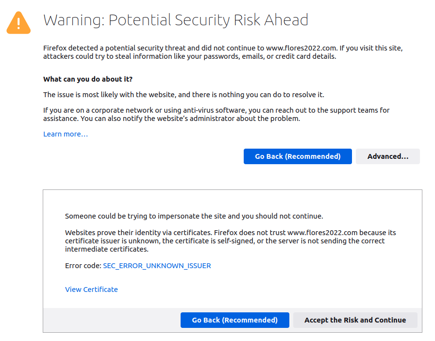
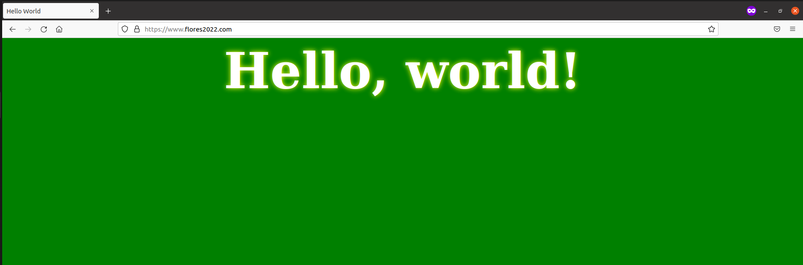
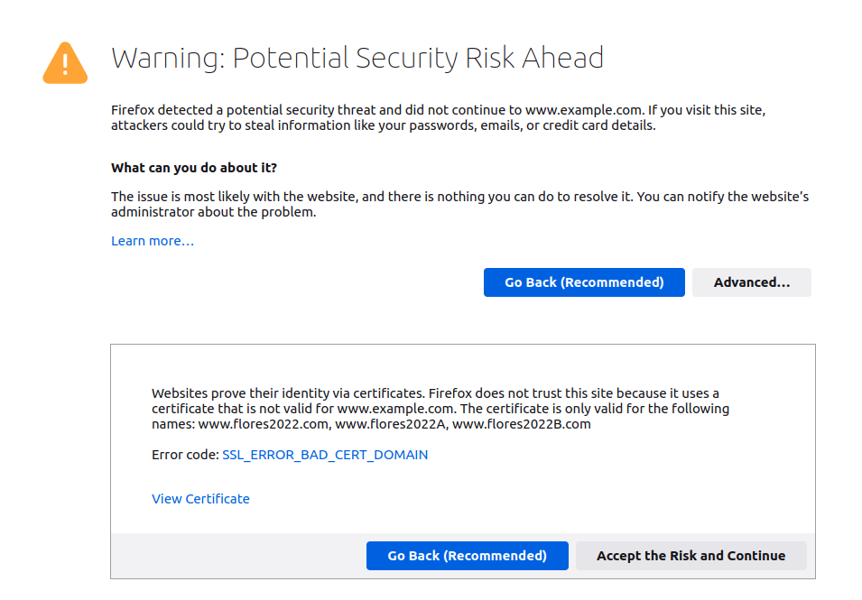
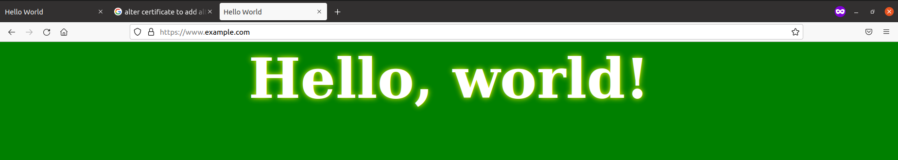

# Task 1
## What part of the certificate indicates this is a CA’s certificate?

## What part of the certificate indicates this is a self-signed certificate?

The Subject Key Identifier and the Authority Key Identifier being the same indicates this certificate is self-signed.
## In the RSA algorithm, we have a public exponent e, a private exponent d, a modulus n, and two secret numbers p and q, such that n = pq. Please identify the values for these elements in your certificate and key files.

### Public Exponent
65537

### Private Exponent


### Modulus


### Prime 1


### Prime 2


# Task 2

We ran the commands that were give to us, changing 'bank32' to 'flroes2022' (our created website), thus creating a certificate signing request.

```bash
openssl req -newkey rsa:2048 -sha256 -keyout server.key -out server.csr -subj "/CN=www.flores2022.com/O=Flores Inc./C=PT" -addext "subjectAltName = DNS:www.flores2022.com, DNS:www.flores2022A.com, DNS:www.flores2022B.com"-passout pass:pass
```

With it, we were able to add two alternative names to the domain:



# Task 3

We ran the commands, changing the needed files so we could copy the configuration file, thus turning the previous certificate signing request into an x509 certificate.

```bash
openssl ca -config openssl.cnf -policy policy_anything -md sha256 -days 3650 -in server.csr -out server.crt -batch -cert ca.crt -keyfile ca.key
```

#Task 4
We changed the docker file to point to our server and certifcate and the virtualhost values to those of our website:

```
<VirtualHost *:443> 
    DocumentRoot /var/www/bank32
    ServerName www.flores2022.com
    ServerAlias www.flores2022A.com
    ServerAlias www.flores2022B.com
    DirectoryIndex index.html
    SSLEngine On 
    SSLCertificateFile /certs/server.crt
    SSLCertificateKeyFile /certs/server.key
</VirtualHost>

<VirtualHost *:80> 
    DocumentRoot /var/www/bank32
    ServerName www.flores2022.com
    DirectoryIndex index_red.html
</VirtualHost>
```

Using this, we tried to access the website, but were unsuccessful due to the following error, due to our certificate being self-signed and being issued by us, thus not being trust-worthy to the browser.



To circumvent this issue, we added our CA certifcate to the trusted certificate authorities of the browser, enabling us to then enter the website.



# Task 5

To get the user to land on our website when accessing 'www.example.com', we changed the virtualhost of our .conf file so that our previously created certificates could be used when accessing this website, while also changing the '/etc/hosts' file to map to the 'www.example.com' website.
However, we were unable to achieve successful results, by the browser being untrustworthy of the certificate we used, since it was mapped to our own website and not to this one.

```
<VirtualHost *:443> 
    DocumentRoot /var/www/bank32
    ServerName www.flores2022.com
    ServerAlias www.flores2022A.com
    ServerAlias www.flores2022B.com
    DirectoryIndex index.html
    SSLEngine On 
    SSLCertificateFile /certs/server.crt
    SSLCertificateKeyFile /certs/server.key
</VirtualHost>

<VirtualHost *:80> 
    DocumentRoot /var/www/bank32
    ServerName www.flores2022.com
    DirectoryIndex index_red.html
</VirtualHost>

<VirtualHost *:443> 
    DocumentRoot /var/www/bank32
    ServerName www.example.com
    DirectoryIndex index.html
    SSLEngine On 
    SSLCertificateFile /certs/server.crt
    SSLCertificateKeyFile /certs/server.key
</VirtualHost>

<VirtualHost *:80> 
    DocumentRoot /var/www/bank32
    ServerName www.example.com
    DirectoryIndex index_red.html
</VirtualHost>
```



# Task 6
Now, being able to generate new CA certificates, we were able to create ones with 'www.example.com' directly, circumventing the browser trust issues by adding this new certifcate to the certificate authorities it trusts. Thus, when opening 'www.example.com', the user would be redirected to our own website, where we could deceive them however we wanted to.



